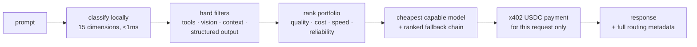

<div align="center">

# @blockrun/llm

### Cut your LLM bill by <!-- br:savings.autoVsBaselinePct -->84<!-- /br:savings.autoVsBaselinePct -->%. One line of TypeScript.

The smart-routing SDK for <!-- br:models.chatVisible -->74<!-- /br:models.chatVisible --> models — every request goes to the cheapest model that can handle it,
paid with an API key or per-request USDC on Solana or Base. No vendor lock-in.

[](https://www.npmjs.com/package/@blockrun/llm)
[](https://www.npmjs.com/package/@blockrun/llm)
[](https://github.com/BlockRunAI/blockrun-llm-ts/actions)
[](LICENSE)
[](package.json)
[](tsconfig.json)

[](https://user.blockrun.ai)
[](https://solana.com)
[](https://base.org)
[](https://x402.org)
[](https://t.me/blockrunAI)

[Sign up / Get an API key](https://user.blockrun.ai) · [Website](https://blockrun.ai) · [Models & Pricing](https://blockrun.ai/models) · [ClawRouter](https://github.com/BlockRunAI/ClawRouter) · [Python SDK](https://github.com/BlockRunAI/blockrun-llm) · [Telegram](https://t.me/blockrunAI)

</div>

---

```typescript
import { LLMClient } from '@blockrun/llm';

// Reads BLOCKRUN_API_KEY (sign up at https://user.blockrun.ai),
// or a wallet key if you'd rather pay per request in USDC.
const client = new LLMClient();

const r = await client.smartChat('Prove step by step that the sum of two odd integers is even.');
console.log(r.model);            // 'deepseek/deepseek-v4-pro' — the right model, not the frontier flagship
console.log(r.routing.savings);  // 0.96 — this exact request cost 96% less than pinning the baseline
console.log(r.response);         // the proof
```

**<!-- br:savings.autoVsBaselinePct -->84<!-- /br:savings.autoVsBaselinePct -->% cheaper than pinning Claude Opus 5** across a realistic workload on the default `auto` profile, **<!-- br:savings.ecoVsBaselinePct -->98<!-- /br:savings.ecoVsBaselinePct -->%** on `eco` — and eco's first stop is the free tier, so simple requests cost $0.00 outright. Not an "up to" figure: the baseline, workload mix, and token ratio are published in [`savings-mix.json`](https://github.com/BlockRunAI/blockrun/blob/main/src/brand/savings-mix.json) so anyone can recompute the claim. Details in [Smart Routing](#smart-routing-router-core-v3).

## Why This SDK

- 🧠 **Smart routing that pays for itself** — the bundled [Router Core V3](https://github.com/BlockRunAI/router-core) engine (shared with [ClawRouter](https://github.com/BlockRunAI/ClawRouter)) classifies every request locally in <1ms across <!-- br:clawrouter.dimensions -->15<!-- /br:clawrouter.dimensions --> dimensions and routes to the cheapest capable model. The main event.
- 🆓 **<!-- br:models.free -->7<!-- /br:models.free --> genuinely free models** — $0 in and out, incl. two 1M-context Nemotrons, a multimodal one, and free coding models from Cohere and Poolside. No rate-limit gimmicks.
- 🔐 **Two ways to connect** — a **BlockRun API key** billed against account credit ([sign up at user.blockrun.ai](https://user.blockrun.ai), [create a key](https://user.blockrun.ai/dashboard/keys), [add credit](https://user.blockrun.ai/dashboard/credits)), or a wallet signature with x402 micropayments and no account at all. Same code either way.
- 💸 **Pay per request in USDC** — x402 micropayments on Solana or Base. $5 covers thousands of requests; agents can pay their own way.
- 🛡️ **Automatic failover** — transient errors (timeouts, 429, 5xx) walk the router's ranked fallback chain instead of failing your request.
- ⚡ **Streaming, OpenAI & Anthropic compat** — drop-in `chat.completions` / `messages` layers, SSE streaming, strict TypeScript.
- 🎨 **Beyond chat** — image, video, music, speech, live search, prediction markets, crypto data, and 40-chain RPC through the same API key or wallet.

## How It Compares

|                    | OpenAI SDK     | OpenRouter        | LiteLLM          | **@blockrun/llm**                                                       |
| ------------------ | -------------- | ----------------- | ---------------- | ----------------------------------------------------------------------- |
| **Cost routing**   | ✗ one vendor   | Manual selection  | Manual selection | **Automatic — <!-- br:savings.autoVsBaselinePct -->84<!-- /br:savings.autoVsBaselinePct -->% cheaper** |
| **Models**         | GPT only       | 200+              | 100+ (BYO keys)  | **<!-- br:models.chatVisible -->74<!-- /br:models.chatVisible -->, one credential** |
| **Free tier**      | ✗              | Rate-limited      | ✗                | **<!-- br:models.free -->7<!-- /br:models.free --> models, no signup**  |
| **Auth**           | API key        | Account + API key | Your API keys    | **API key *or* wallet signature**                                       |
| **Payment**        | Card + invoice | Credit card       | BYO keys         | **Account credit or USDC per-request**                                  |
| **Agent-ready**    | ✗              | ✗                 | ✗                | **✓ — one key, or agents fund their own wallet**                        |

## Installation

```bash
npm install @blockrun/llm   # Account API keys or Base wallets; smart routing included
```

<details>
<summary><strong>Solana payments</strong> — two more optional peers</summary>

```bash
npm install @blockrun/llm @solana/web3.js @solana/spl-token
```

Why they are not automatic: `@solana/spl-token` pulls in `bigint-buffer`, whose
native `toBigIntLE()` has an unpatched buffer overflow
([GHSA-3gc7-fjrx-p6mg](https://github.com/advisories/GHSA-3gc7-fjrx-p6mg)) with no
fixed release anywhere. As an optional *dependency* it landed in the lockfile of
every consumer, including projects that only ever pay on Base. As an optional
*peer* it reaches only the projects that ask for Solana. Calling a Solana path
without them throws an error naming the exact install command.

</details>

<details>
<summary><strong>Supported chains</strong> — Solana (recommended), Base, Base Sepolia</summary>

| Chain | Network | Payment | Status |
|-------|---------|---------|--------|
| **Solana** | Solana Mainnet | USDC (SPL) | Recommended for new wallets |
| **Base** | Base Mainnet (Chain ID: 8453) | USDC | Supported |
| **Base Testnet** | Base Sepolia (Chain ID: 84532) | Testnet USDC | Development |

**Protocol:** x402 v2 (CDP Facilitator)

</details>

The Anthropic SDK is a runtime dependency because the public compatibility wrapper exposes its types. Solana signing dependencies remain optional and are unnecessary for account billing.

## Quick Start: API Key

1. [Sign up or sign in](https://user.blockrun.ai).
2. Create a key on [API Keys](https://user.blockrun.ai/dashboard/keys) and add credit on [Credits](https://user.blockrun.ai/dashboard/credits).
3. Set the key and use any SDK client. No wallet or payment chain is required.

```bash
export BLOCKRUN_API_KEY=brk_live_...
```

```typescript
import { LLMClient, ImageClient, VideoClient, BlockrunClient } from '@blockrun/llm';

const llm = new LLMClient(); // Reads BLOCKRUN_API_KEY
console.log(await llm.chat('openai/gpt-5.2', 'Hello!'));
const images = new ImageClient({ apiKey: process.env.BLOCKRUN_API_KEY });
const videos = new VideoClient(); // Same account; async jobs are polled automatically
const api = new BlockrunClient();
// Generic access to Responses and other service endpoints:
const response = await api.post('/v1/responses', { model: 'openai/gpt-5.2', input: 'Hello!' });
```

All named service clients, `SolanaLLMClient`, and the OpenAI/Anthropic compatibility
wrappers accept `apiKey`. They use `https://api.blockrun.ai`; an OpenAI-style
`https://api.blockrun.ai/v1` base is also accepted. Override with `apiUrl`
(`baseURL` for `OpenAI`) or `BLOCKRUN_API_BASE_URL`.

An explicit `apiKey` wins over the environment. An explicit `privateKey` selects
wallet mode even when `BLOCKRUN_API_KEY` is set; passing both explicit credentials
is an error. With no explicit credential, `BLOCKRUN_API_KEY` beats the wallet key
env vars — a process holding both runs in account mode. Invalid or exhausted API keys never fall back to wallet payments.
Errors preserve `statusCode`, account error `response.code`, and `retryAfter`.
Account credentials are restricted to the configured origin, including polling. Account POSTs are not automatically replayed, including through the Anthropic wrapper. GET/HEAD requests can retry temporary gateway errors; accepted jobs keep polling the same job within the original timeout. A 429 returns `retryAfter` to the caller.

Check [Activity](https://user.blockrun.ai/dashboard/activity) for account usage and charges. Chat uses token usage; media and data can use duration, image, or per-request units. When adding credit, the checkout shows the credit amount and total card charge, including any processing fee. Keep API keys in server or local environment variables, never in browser code or logs.

For asynchronous jobs, retain the complete returned `poll_url`, including its query parameters. If polling times out, check the original job and Activity before submitting again.

To switch back to a wallet, unset `BLOCKRUN_API_KEY` and create a new wallet client, or pass an explicit `privateKey` to the appropriate client. Existing clients retain their original credentials; changing a wallet chain does not change account billing.

`getSpending()` reports x402 settlements only and throws in account mode; wallet
address/balance helpers require a wallet. Account credit does not sign trades or
transfer wallet funds. Service availability depends on the account gateway and model.

## Quick Start: Solana (Recommended Wallet Chain)

```typescript
import { setupAgentClient, SolanaLLMClient } from '@blockrun/llm';

// API key when configured; otherwise new wallets use Solana.
// Existing chain preferences and Base-only wallets are preserved.
const client = await setupAgentClient();
console.log(await client.smartChat('Explain photosynthesis.'));

// Explicit Solana wallet; requires the optional Solana dependencies below.
const solana = new SolanaLLMClient({ privateKey: process.env.SOLANA_WALLET_KEY });
```

## Quick Start: Base Wallet

```typescript
import { LLMClient } from '@blockrun/llm';

const client = new LLMClient();  // Uses BASE_CHAIN_WALLET_KEY (never sent to server)

// Recommended: let the router pick the cheapest capable model
const result = await client.smartChat('Hello!');

// Or pin a model yourself
const response = await client.chat('openai/gpt-4o', 'Hello!');
```

That's it. The SDK handles x402 payment automatically — and `smartChat()`
keeps the bill down on every request. The router is bundled: no extra
package to install.

### Try It Free (No USDC Required)

Want to kick the tires before funding a wallet? Route to BlockRun's free tier:

```typescript
import { LLMClient } from '@blockrun/llm';

const client = new LLMClient();  // Wallet still required for signing, but $0 charged

// Option 1: call a free model directly
const reply = await client.chat('nvidia/nemotron-3.5-lightning', 'Explain x402 in 1 sentence');

// Option 2: let the smart router pick — 'eco' ranks the free tier first
const result = await client.smartChat('What is 2+2?', { routingProfile: 'eco' });
console.log(result.model);     // a free-tier model — $0 in and out
console.log(result.response);  // '4'
console.log(result.routing.savings); // 1 (100%)
```

There is no `free` routing profile in `smartChat()` — `routingProfile` accepts
`'eco' | 'auto' | 'premium'`. (ClawRouter's `/model free` is a feature of its
own proxy, not of this SDK's router options.) For guaranteed $0, pin one of
the free model ids below; for smart-routed $0-first, use `eco`.

**Available free models** — input and output both $0. The free tier is **no
longer NVIDIA-only**, so pin these by full model id rather than by an
`nvidia/*` prefix. Full contexts and notes in [Free Tier](#free-tier);
`client.listModels()` returns the live catalog at runtime.

| Model ID | Context | Best For |
|----------|---------|----------|
| `nvidia/nemotron-3.5-lightning` | 1M | Thinking-mode reasoning at 1M context |
| `nvidia/nemotron-3-ultra-550b` | 1M | Largest free model — 550B |
| `nvidia/nemotron-3-nano-omni-30b-a3b-reasoning` | 256K | Multimodal reasoning — text + images |
| `nvidia/nemotron-3-nano-30b` | 128K | Compact + fast, good for high-volume light tasks |
| `nvidia/llama-3.2-11b-vision` | 128K | Vision-language — accepts images |
| `cohere/north-mini-code` | 256K | Compact coding model, sub-second responses |
| `poolside/laguna-xs-2.1` | 128K | Coding model |

## Quick Start (Solana)

```typescript
import { SolanaLLMClient } from '@blockrun/llm';

// SOLANA_WALLET_KEY env var (bs58-encoded Solana secret key)
const client = new SolanaLLMClient();
const response = await client.chat('openai/gpt-4o', 'gm Solana');
console.log(response);
```

Set `SOLANA_WALLET_KEY` to your bs58-encoded Solana secret key. Payments are automatic via x402 — your key never leaves your machine.

## Smart Routing (Router Core V3)

Let the SDK automatically pick the cheapest capable model for each request — **<!-- br:savings.autoVsBaselinePct -->84<!-- /br:savings.autoVsBaselinePct -->% cheaper than pinning Claude Opus 5** for the same traffic on `auto`, **<!-- br:savings.ecoVsBaselinePct -->98<!-- /br:savings.ecoVsBaselinePct -->%** on `eco`.

Not an "up to" figure. The baseline, the workload mix and the token ratio are
published in [`savings-mix.json`](https://github.com/BlockRunAI/blockrun/blob/main/src/brand/savings-mix.json),
priced against the live catalog, so anyone can recompute the claim and get the
same answer.

Smart routing is powered by the product-neutral
[`@blockrun/router-core`](https://github.com/BlockRunAI/router-core) V3 engine —
the same deterministic portfolio router that drives
[ClawRouter](https://github.com/BlockRunAI/ClawRouter). It is **bundled into
this SDK**: no separate router package to install, and routing runs 100%
locally with zero external calls.

Three ways to use it:

```typescript
// 1. smartChat() — one-line routed chat
const result = await client.smartChat('What is 2+2?');

// 2. smartChatCompletion() — full agent/tool conversations, routed
const agent = await client.smartChatCompletion(messages, { tools, toolChoice: 'auto' });

// 3. blockrun/auto | blockrun/eco | blockrun/premium — model aliases accepted
//    by chat(), chatCompletion(), and chatCompletionStream() on both chains
const reply = await client.chatCompletion('blockrun/auto', messages);

// Inspect a decision without paying for anything
const decision = await client.route('Prove the Riemann hypothesis');
```

The aliases are resolved locally by `LLMClient`, `SolanaLLMClient`, and the
OpenAI-compat layer. The Anthropic-compat layer proxies straight to the
gateway's `/v1/messages` and does **not** resolve them — pass a concrete
model id there.

```typescript
import { LLMClient } from '@blockrun/llm';

const client = new LLMClient();

// Auto-routes to cheapest capable model
const result = await client.smartChat('What is 2+2?');
console.log(result.response);     // '4'
console.log(result.model);        // 'qwen/qwen3.7-flash' (cheap, fast)
console.log(`Saved ${(result.routing.savings * 100).toFixed(0)}%`); // this request, vs the Opus 5 baseline

// Complex reasoning task -> routes to reasoning model
const complex = await client.smartChat('Prove the Riemann hypothesis step by step');
console.log(complex.model);  // 'xai/grok-4.3'

// Inspect how the request was classified and ranked (Router Core V3.5 portfolio).
console.log(complex.routing.method);     // 'portfolio'
console.log(complex.routing.taskType);   // 'reasoning'
console.log(complex.routing.candidates); // ranked, capability-eligible models

// Inspect the fallback chain SmartChat will walk on transient errors.
console.log(complex.routing.fallbacks);  // ['anthropic/claude-opus-4.7', ...]
```

### Automatic Fallback on Transient Errors

`smartChat()` populates a fallback chain from the portfolio ranking and
`chat()` / `chatCompletion()` walk it automatically when the primary model
returns a transient error — timeouts, network failures, 429 rate limits, or
5xx responses (502/503/504/522/524). Other 4xx errors and `PaymentError`
propagate immediately so wallet / auth issues surface fast. (Solana's internal
stale-blockhash re-sign is a separate, lower-level retry inside the payment
step — see [How Payment Works](#phase-2--every-request-pays-itself-automatic-x402).)

```typescript
// Manually pass a fallback chain to chat() / chatCompletion()
const reply = await client.chat('nvidia/nemotron-3.5-lightning', 'hello', {
  fallbackModels: ['nvidia/nemotron-3-nano-30b', 'cohere/north-mini-code'],
});
// If nemotron-3.5-lightning times out, the SDK retries against the next model
// and logs each hop to stderr: "[@blockrun/llm] <from> -> <to> (...)".
```

### Routing Profiles

| Profile | Strategy | Savings vs Opus 5 | Best For |
|---------|----------|-------------------|----------|
| `eco` | Cheapest capable model — ranks the <!-- br:models.free -->7<!-- /br:models.free -->-model free tier first | **<!-- br:savings.ecoVsBaselinePct -->98<!-- /br:savings.ecoVsBaselinePct -->%** | Cost-sensitive production, zero-cost testing |
| `auto` | Best balance of cost/quality (default) | **<!-- br:savings.autoVsBaselinePct -->84<!-- /br:savings.autoVsBaselinePct -->%** | General use |
| `premium` | Top-tier models (OpenAI, Anthropic) | 0% | Quality-critical tasks |

For guaranteed $0, call a free model directly with `chat()` — see
[Try It Free](#try-it-free-no-usdc-required). ClawRouter's `/model free`
profile belongs to its own proxy; `smartChat()`'s options are the three above.

```typescript
// Use premium models for complex tasks
const result = await client.smartChat(
  'Write production-grade async TypeScript code',
  { routingProfile: 'premium' }
);
console.log(result.model);  // 'anthropic/claude-opus-4.7'
```

### How the Router Works



Auto uses the deterministic **Router Core V3.5 portfolio strategy**
(`DEFAULT_ROUTING_CONFIG.version` in the pinned engine): it classifies the task shape locally across
<!-- br:clawrouter.dimensions -->15<!-- /br:clawrouter.dimensions --> dimensions
(token count, code presence, reasoning markers, technical/creative terms,
agentic patterns, …), enforces tool / vision / structured-output / context
constraints as **hard filters**, then ranks an ordered candidate portfolio.
The winner becomes `routing.model`; the rest surface as `routing.candidates`
and feed SmartChat's transient-error fallback chain. Routing stays 100% local
and deterministic — <1ms, no extra model call, no network hop.

Classification still maps to one of four tiers (`routing.tier`). Each
tier × profile has a designated primary (what the rules strategy —
`routing.method: 'rules'`, the rollback lever — routes to directly, and what
anchors the portfolio's candidate pool):

| Tier | Example Tasks | ECO | AUTO | PREMIUM |
|------|---------------|-----|------|---------|
| SIMPLE | "What is 2+2?", definitions | nemotron-3.5-lightning (**FREE**) | gemini-2.5-flash | gemini-3.5-flash |
| MEDIUM | Code snippets, explanations | glm-5.3-flash | gemini-3.5-flash | gpt-5.3-codex |
| COMPLEX | Architecture, long documents | glm-5.3-flash | gemini-3.1-pro | claude-fable-5 |
| REASONING | Proofs, multi-step reasoning | deepseek-reasoner | deepseek-reasoner | claude-sonnet-5 |

Since Router Core V3.5 every primary and every fallback rung is a model listed
on `/v1/models` — nothing the router picks is withheld from the public pricing
page, and the published savings claim is priced on those same visible models.

This table mirrors ClawRouter's tier configs at the version this SDK pins;
the [ClawRouter README](https://github.com/BlockRunAI/ClawRouter#how-it-works)
is the live source of truth as models and prices move.

### Routing Metadata Reference

Every `smartChat()` result carries the full decision on `result.routing`
(type `RoutingDecision`) — enough to log, audit, or replay why a model was
picked:

| Field | Description |
|-------|-------------|
| `model` | Selected model id (same as `result.model`) |
| `method` | `'portfolio'` (the Auto default), `'rules'` (rollback strategy), or `'llm'` |
| `tier` | Task tier: `'SIMPLE'`, `'MEDIUM'`, `'COMPLEX'`, or `'REASONING'` |
| `taskType` | Portfolio task classification: `'chat'`, `'extraction'`, `'code_edit'`, `'code_agent'`, `'tool_agent'`, `'debug'`, `'reasoning'`, `'reasoning_math'`, `'long_context'`, `'vision'`, … |
| `candidates` | Ordered, capability-eligible models ranked by the portfolio router; the first entry is `model` |
| `candidateScores` | Per-candidate score breakdown (`quality` / `cost` / `speed` / `reliability`), ordered with `candidates` |
| `fallbacks` | The chain `chat()` walks on transient errors (timeout / network / 429 / 5xx) — `candidates` minus the primary, with ClawRouter's proxy-namespace `free/*` ids mapped to their `nvidia/*` gateway ids (SDK-computed) |
| `savings` | 0–1 fraction saved vs the premium baseline |
| `costEstimate` / `baselineCost` | Estimated cost of the pick vs that baseline, in USD |
| `confidence` | Sigmoid-calibrated classifier confidence, 0–1 |
| `routerVersion` | `'v3-portfolio'` or `'v2-rules'` |
| `profile` | Routing profile applied: `'auto'`, `'eco'`, `'premium'`, or `'agentic'` |
| `reasoning` | Human-readable explanation of the decision |
| `tierConfigs` | The tier → primary/fallback map the decision was made against |

### TypeScript Types

`RoutingDecision`, `RoutingProfile`, `RoutingTier`, `RoutingTaskType`,
`RoutingTierConfig`, `SmartChatCompletionOptions`, and
`SmartChatCompletionResponse` are exported from `@blockrun/llm`. They are
derived from
[`@blockrun/router-core`](https://github.com/BlockRunAI/router-core), pinned
to a reviewed immutable commit, and shipped **inlined in this SDK's
declaration files and runtime bundle** — you install nothing extra to route
or to typecheck.

### Going Deeper

- [ClawRouter](https://github.com/BlockRunAI/ClawRouter) — the router itself: OpenClaw plugin, standalone proxy for Cursor / continue.dev / any OpenAI-compatible client, Telegram integration
- [Routing profiles in depth](https://github.com/BlockRunAI/ClawRouter/blob/main/docs/routing-profiles.md) — ECO / AUTO / PREMIUM details
- [How the routing engine works](https://github.com/BlockRunAI/ClawRouter/blob/main/docs/smart-llm-router-14-dimension-classifier.md) — the classifier, dimension by dimension
- [Router benchmark](https://github.com/BlockRunAI/ClawRouter/blob/main/docs/llm-router-benchmark-46-models-sub-1ms-routing.md) — sub-1ms routing across the catalog
- [ClawRouter vs OpenRouter](https://github.com/BlockRunAI/ClawRouter/blob/main/docs/clawrouter-vs-openrouter-llm-routing-comparison.md) — head-to-head comparison
- [`@blockrun/router-core`](https://github.com/BlockRunAI/router-core) — the deterministic routing engine both share

## Solana Support

Pay for AI calls with Solana USDC via [sol.blockrun.ai](https://sol.blockrun.ai):

```typescript
import { SolanaLLMClient } from '@blockrun/llm';

// SOLANA_WALLET_KEY env var (bs58-encoded Solana secret key)
const client = new SolanaLLMClient();

// Or pass key directly
const client2 = new SolanaLLMClient({ privateKey: 'your-bs58-solana-key' });

// Same API as LLMClient
const response = await client.chat('openai/gpt-4o', 'gm Solana');
console.log(response);

// Live Search with Grok (Solana payment)
const tweet = await client.chat('xai/grok-4.5', 'What is trending on X?', { search: true });
```

**Setup:**
1. Export your Solana wallet key: `export SOLANA_WALLET_KEY="your-bs58-key"`
2. Fund with USDC on Solana mainnet
3. That's it — payments are automatic via x402

**Supported endpoint:** `https://sol.blockrun.ai/api`
**Payment:** Solana USDC (SPL, mainnet)

## How Payment Works

In wallet mode, no API key is required. You hold USDC in your own wallet, and **every request pays for itself** with an on-chain micropayment. Two phases:

### Phase 1 — Fund your wallet once

You only do this when your balance runs low. Three ways to get USDC into your wallet:

- **(a) Buy with a card (Base USDC).** Call the new `onramp()` method to mint a one-time Coinbase Onramp link, then open the returned `pay.coinbase.com` URL — pay by card/bank in 60+ fiat currencies and the USDC lands in your wallet. The call itself is **free**. Onramp is **Base-only** (buying USDC with a card always lands Base USDC), and the funding address must equal your signing wallet:

  ```typescript
  const { url } = await client.onramp(client.getWalletAddress());
  console.log(`Fund your wallet: ${url}`);  // single-use, expires ~5 min — mint at click time
  ```

- **(b) Transfer existing USDC.** Send USDC you already hold to your wallet address (`client.getWalletAddress()`). On Base, send Base USDC; on Solana (`SolanaLLMClient`), send Solana SPL USDC.

- **(c) Skip funding entirely.** Use the free models (e.g. `nvidia/nemotron-3.5-lightning`) — every call is **$0**, no balance required.

$5 of USDC covers thousands of paid requests. Check your balance any time:

```typescript
const balance = await client.getBalance();        // USDC on Base
console.log(`Balance: $${balance.toFixed(2)} USDC`);
```

### Phase 2 — Every request pays itself (automatic x402)

You just call e.g. `client.chat(...)` — the payment is invisible:

1. You send a request to BlockRun's API.
2. The gateway returns **402 Payment Required** with the price.
3. The SDK signs a USDC payment **locally** (EIP-712) — on **Base** for `LLMClient`, on **Solana** for `SolanaLLMClient` — using your wallet key.
4. The request is retried automatically with the payment proof.
5. The gateway settles on-chain and returns the AI response.

One call, no separate pay step. Free-tier models settle at **$0** (no payment signed).

On **Solana**, step 3 pins the payment to a recent blockhash that is valid for
roughly 60 seconds. If one expires between signing and verification,
`SolanaLLMClient` re-signs against a fresh blockhash and retries — up to twice,
with a short backoff — rather than surfacing a payment error you would only
have to retry by hand.

The retry is deliberately narrow. It fires only when the gateway explicitly
reports a *verification-phase* stale blockhash. Settlement failures, ambiguous
rejections, insufficient funds and malformed responses all fail immediately.
Verification runs strictly before settlement, so a retryable rejection means no
transaction was broadcast and you cannot be charged twice.

### Track spend and verify settlements

```typescript
import { getCostSummary } from '@blockrun/llm';

const spent = client.getSpending();               // this session
console.log(`Spent $${spent.totalUsd.toFixed(4)} across ${spent.calls} calls`);

const summary = getCostSummary();                  // across sessions (~/.blockrun/data/costs.jsonl)
console.log(`Lifetime: $${summary.totalUsd.toFixed(2)} over ${summary.calls} calls`);
```

In wallet mode, every paid request is a real on-chain USDC transfer — look up your wallet address on [Basescan](https://basescan.org) (or a Solana explorer) to verify each settlement independently.

**Non-custodial by design: your private key never leaves your machine** — it is only used for local signing, and no funds are ever held by BlockRun.

## `BlockrunClient` — the universal primitive (recommended for new code)

Starting in `2.5.0`, the SDK ships a single `BlockrunClient` that speaks to
**every** BlockRun endpoint over x402. New API surfaces are intended to be
distributed as [Claude Code skills](https://github.com/anthropics/skills)
that drive this primitive — no SDK release required to add an endpoint.

```typescript
import { BlockrunClient } from '@blockrun/llm';

const br = new BlockrunClient();

// Sync GET — Surf market price (Tier 1)
const btc = await br.get('/v1/surf/market/price', { symbol: 'BTC' });

// Sync POST — raw on-chain SQL (Tier 3)
const rows = await br.post('/v1/surf/onchain/sql', {
  query: 'SELECT block_number FROM ethereum.blocks ORDER BY block_number DESC LIMIT 1',
});

// Submit + poll — long-running video gen (settled only on completion)
const video = await br.poll('/v1/videos/generations', {
  model: 'xai/grok-imagine-video',
  prompt: 'a red apple spinning',
});

// Streaming SSE — chat completions
for await (const chunk of br.stream('/v1/chat/completions', {
  model: 'anthropic/claude-sonnet-5',
  messages: [{ role: 'user', content: 'Hi' }],
  stream: true,
})) {
  process.stdout.write(chunk?.choices?.[0]?.delta?.content ?? '');
}
```

Four call shapes cover every endpoint type:
- `get<T>(path, params?)` — synchronous GET (price, ranking, list, news)
- `post<T>(path, body?)` — synchronous POST (on-chain SQL, search)
- `poll<T>(path, body?, { budgetMs, intervalMs })` — submit + poll (image, video, music, voice)
- `stream<T>(path, body?)` — async iterator over SSE chunks (chat)

The per-API client classes (`LLMClient`, `ImageClient`, `VideoClient`,
`PortraitClient`, `VoiceClient`, `MusicClient`, `SearchClient`, `RpcClient`,
`PriceClient`, `SurfClient`) all remain — they will be soft-deprecated in 2.6 (rewritten as
shims over `BlockrunClient`) and removed in 3.0.

## Available Models

**Prices are not listed here.** They change often, and a number copied into a
README is wrong the day after it lands. See **[blockrun.ai/models](https://blockrun.ai/models)**
for live rates, or read them from the catalog at runtime — `client.listModels()`
and `client.listImageModels()` return exactly what the gateway is charging.

### OpenAI GPT-5.6 Family

Three tiers on one 1.05M-context base — Sol (deepest reasoning), Terra
(balanced), Luna (cheap and fast). Each has a `-pro` sibling that thinks
longer at the same token price.

| Model | Context |
|---|---|
| `openai/gpt-5.6-sol` | 1.05M |
| `openai/gpt-5.6-sol-pro` | 1.05M |
| `openai/gpt-5.6-terra` | 1.05M |
| `openai/gpt-5.6-terra-pro` | 1.05M |
| `openai/gpt-5.6-luna` | 1.05M |
| `openai/gpt-5.6-luna-pro` | 1.05M |

### OpenAI GPT-5.5 / 5.4 / 5.2 Families

| Model | Context | Notes |
|---|---|---|
| `openai/gpt-5.5` | 1.05M |  |
| `openai/gpt-5.5-pro` | 1.05M |  |
| `openai/chat-latest` | 128K | ChatGPT Instant — the model behind chatgpt.com |
| `openai/gpt-5.4` | 1.05M |  |
| `openai/gpt-5.4-pro` | 1.05M |  |
| `openai/gpt-5.4-mini` | 400K |  |
| `openai/gpt-5.4-nano` | 1.05M |  |
| `openai/gpt-5.2` | 400K |  |
| `openai/gpt-5.2-pro` | 400K |  |
| `openai/gpt-5.3-codex` | 400K | Coding/agentic SKU |
| `openai/gpt-5-mini` | 200K |  |

### OpenAI GPT-4 Family

| Model | Context |
|---|---|
| `openai/gpt-4.1` | 128K |
| `openai/gpt-4.1-mini` | 128K |
| `openai/gpt-4.1-nano` | 128K |
| `openai/gpt-4o` | 128K |
| `openai/gpt-4o-mini` | 128K |

### OpenAI O-Series (Reasoning)

| Model | Context |
|---|---|
| `openai/o1` | 200K |
| `openai/o3` | 200K |
| `openai/o3-mini` | 128K |
| `openai/o4-mini` | 128K |

### Anthropic Claude

| Model | Context | Notes |
|---|---|---|
| `anthropic/claude-fable-5` | 1M | Mythos-class flagship above Opus — always-on thinking, 128K output |
| `anthropic/claude-opus-5` | 1M | Flagship — the baseline the routing savings claim is measured against |
| `anthropic/claude-opus-4.8` | 1M | Agentic coding + adaptive thinking, 128K output |
| `anthropic/claude-opus-4.7` | 1M |  |
| `anthropic/claude-opus-4.5` | 200K |  |
| `anthropic/claude-sonnet-5` | 1M | Best cost/quality balance for long-context agent turns |
| `anthropic/claude-sonnet-4.6` | 1M |  |
| `anthropic/claude-sonnet-4.5` | 200K |  |
| `anthropic/claude-haiku-4.5` | 200K |  |

### Google Gemini

| Model | Context |
|---|---|
| `google/gemini-3.1-pro` | 1M |
| `google/gemini-3.6-flash` | 1M |
| `google/gemini-3.5-flash` | 1M |
| `google/gemini-3-flash-preview` | 1M |
| `google/gemini-3.5-flash-lite` | 1M |
| `google/gemini-3.1-flash-lite` | 1M |
| `google/gemini-2.5-pro` | 1M |
| `google/gemini-2.5-flash` | 1M |
| `google/gemini-2.5-flash-lite` | 1M |

### DeepSeek

DeepSeek upstream serves the legacy `deepseek-chat` / `deepseek-reasoner`
aliases as V4 Flash non-thinking / thinking modes. V4 Pro is the flagship
paid SKU; the vision SKU is an experimental preview.

| Model | Context | Notes |
|---|---|---|
| `deepseek/deepseek-v4-pro` | 1M | V4 flagship — strongest open-weight reasoner |
| `deepseek/deepseek-v4-flash-vision-exp` | 1M | Experimental vision preview |
| `deepseek/deepseek-chat` | 1M | V4 Flash non-thinking |
| `deepseek/deepseek-reasoner` | 1M | V4 Flash thinking (same upstream, thinking on by default) |

### xAI Grok

The older Grok chat SKUs (grok-3/3-mini, the grok-4 fast families,
grok-code-fast-1, grok-2-vision) have left the catalog. Retired ids stay
callable — the gateway redirects them to a healthy model — but SmartChat
only ranks what `/v1/models` lists.

| Model | Context | Notes |
|---|---|---|
| `xai/grok-4.5` | 500K | Flagship — reasoning + vision, native Live Search (`search: true`) |
| `xai/grok-4.3` | 1M | Reasoning + vision, tuned for agentic workflows |
| `xai/grok-build-0.1` | 256K | Fast agentic coding model |

### Moonshot, MiniMax, Z.ai, Qwen

| Model | Context | Notes |
|---|---|---|
| `moonshot/kimi-k3` | 1M | Replaces the retired `kimi-k2.5` / `k2.6` SKUs |
| `minimax/minimax-m3` | 1M |  |
| `minimax/minimax-m2.7` | 200K |  |
| `zai/glm-5.3` | 1M |  |
| `zai/glm-5.3-flash` | 1M | Cheapest vision-capable paid SKU |
| `zai/glm-5.2` | 1M |  |
| `zai/glm-5.1` | 200K |  |
| `zai/glm-5` | 200K |  |
| `zai/glm-5-turbo` | 200K |  |
| `qwen/qwen3.7-max` | 1M |  |
| `qwen/qwen3.7-plus` | 1M |  |
| `qwen/qwen3.8-flash` | 1M |  |
| `qwen/qwen3.7-flash` | 1M | Cheapest paid chat model in the catalog |

### Tencent, Xiaomi

| Model | Context |
|---|---|
| `tencent/hy3` | 256K |
| `xiaomi/mimo-v2.5` | 1M |
| `xiaomi/mimo-v2.5-pro` | 1M |

### Free Tier

Input and output both $0 — no promo, no rate-limit gimmick. The free tier is
**no longer NVIDIA-only**, so pin these by full model id rather than by an
`nvidia/*` prefix, or let `routingProfile: 'eco'` rank them first.

| Model | Context | Notes |
|---|---|---|
| `nvidia/nemotron-3-nano-omni-30b-a3b-reasoning` | 256K | Multimodal reasoning — text + images |
| `nvidia/nemotron-3.5-lightning` | 1M | Thinking-mode reasoning at 1M context |
| `nvidia/nemotron-3-nano-30b` | 128K | Compact and fast, good for high-volume light tasks |
| `nvidia/llama-3.2-11b-vision` | 128K | Vision-language — accepts images |
| `nvidia/nemotron-3-ultra-550b` | 1M | Largest free model — 550B, 1M context |
| `cohere/north-mini-code` | 256K | Compact coding model, sub-second responses |
| `poolside/laguna-xs-2.1` | 128K | Coding model |

### Image Generation
| Model | Notes |
|---|---|
| `openai/gpt-image-1` | Native GPT-4o image generation |
| `openai/gpt-image-2` | Reasoning-driven — multilingual text rendering, character consistency |
| `google/nano-banana` | Gemini 2.5 Flash image generation — fast and efficient |
| `google/nano-banana-2` | Gemini 3.1 Flash — pro-level quality at Flash speed |
| `google/nano-banana-pro` | Gemini 3 Pro — highest quality, up to 4K |
| `xai/grok-imagine-image` | Fast, 300 RPM |
| `xai/grok-imagine-image-pro` | Quality tier, 30 RPM |
| `bytedance/seedream-5-pro` | Flagship generation + editing, up to 4K-class, reference images |
| `zai/cogview-4` | Up to 1440x1440 |

Image editing (`client.edit`) via `/v1/images/image2image`: `openai/gpt-image-1`, `openai/gpt-image-2`, `google/nano-banana`, and `google/nano-banana-pro`. Pass a single base64 `data:image/...` URI to edit one image, or an array of 2–4 URIs to **fuse** them (e.g. a subject + a brand logo). Fusion caps: `openai/*` up to 4 source images, `google/*` up to 3. A `mask` cannot be combined with multiple source images.

```ts
// Multi-image fusion with Nano Banana
const fused = await client.edit(
  "Place the logo on the t-shirt",
  [subjectDataUri, logoDataUri],
  { model: "google/nano-banana" }
);
console.log(fused.data[0].url);
```

### Video Generation
| Model | Default | Max | Notes |
|---|---|---|---|
| `xai/grok-imagine-video` | 8s | 15s | 480p default, 720p available; text or image to video |
| `xai/grok-imagine-video-1.5` | 8s | 15s | Flagship — native synced audio; 480p default, 720p available |
| `bytedance/seedance-1.5-pro` | 5s | 12s | Budget 720p with synced audio. No RealFace assets |
| `bytedance/seedance-2.0-fast` | 5s | 15s | 720p, ~60-80s to generate. RealFace assets supported |
| `bytedance/seedance-2.0-mini` | 5s | 15s | 480p/720p at half the flagship rate. RealFace supported |
| `bytedance/seedance-2.0` | 5s | 15s | Premium 720p with synced audio. RealFace supported |
| `bytedance/seedance-2.5` | 5s | 30s | Long-form — up to 30s, multilingual, multi-asset |
| `azure/sora-2` | 4s | 12s | Sora 2 via Azure AI Foundry — 720p with synced audio; 4, 8 or 12s |

```ts
import { VideoClient } from '@blockrun/llm';

const client = new VideoClient();
const result = await client.generate('a red apple slowly spinning on a wooden table');
console.log(result.data[0].url);             // permanent MP4 URL
console.log(result.data[0].duration_seconds); // 8

// Image-to-video
const r2 = await client.generate('the subject turns and smiles', {
  imageUrl: 'https://example.com/portrait.jpg',
});

// Token360 / Seedance options (silently ignored by xAI Grok video)
const r3 = await client.generate('aerial drone shot over a snowy mountain', {
  model: 'bytedance/seedance-2.0-fast',
  aspectRatio: '21:9',
  resolution: '1080p',
  generateAudio: true,    // omit to use the model's default
  seed: 42,
  watermark: false,
  returnLastFrame: true,  // useful for clip chaining
});

// First-and-last-frame interpolation (Seedance only): the model tweens
// from imageUrl (first frame) to lastFrameUrl (final frame).
// Priced identically to image-to-video.
const r4 = await client.generate('the flower blooms in golden morning light', {
  model: 'bytedance/seedance-1.5-pro',
  imageUrl: 'https://example.com/bud.jpg',
  lastFrameUrl: 'https://example.com/bloom.jpg',
});

// Omni / multi-reference (Seedance 2.0 only): up to 9 reference images
// for character/style consistency. Cite them as "image 1", "image 2" in
// the prompt. Mutually exclusive with imageUrl / lastFrameUrl /
// realFaceAssetId.
const r5 = await client.generate(
  'the character from image 1 walks through the city from image 2',
  {
    model: 'bytedance/seedance-2.0',
    referenceImageUrls: [
      'https://example.com/character.jpg',
      'https://example.com/city.jpg',
    ],
  }
);
```

### Text-to-Speech & Sound Effects

`SpeechClient` wraps BlockRun Voice (ElevenLabs): `POST /v1/audio/speech`
(OpenAI-compatible TTS), `POST /v1/audio/sound-effects`, and the free
`GET /v1/audio/voices`. TTS price scales with character count:
`(chars / 1000) × model rate`, with a per-request minimum. Synthesis is
synchronous (<1s for Flash).

| Model | Max Input | Notes |
|---|---|---|
| `elevenlabs/flash-v2.5` | 40k chars | ~75ms latency, 32 languages (default) |
| `elevenlabs/turbo-v2.5` | 40k chars | ~250ms latency, balanced quality |
| `elevenlabs/multilingual-v2` | 10k chars | Long-form narration, audiobooks — 29 languages |
| `elevenlabs/v3` | 5k chars | Max expressiveness, 70+ languages |
| `bytedance/seed-audio-1.0` | 3k chars | Prompt-directed — describe voice, emotion and staging in words |
| `elevenlabs/sound-effects` | 1k chars | Sound effects up to 22s |

```ts
import { SpeechClient } from '@blockrun/llm';

const client = new SpeechClient();

// Text-to-speech (voice aliases: sarah, george, laura, charlie,
// river, roger, callum, harry — or any raw ElevenLabs voice_id)
const result = await client.generate('Welcome to BlockRun.', { voice: 'george' });
console.log(result.data[0].url);  // audio URL (mp3 by default)

// Other formats / speed
const wav = await client.generate('Breaking news from the world of micropayments.', {
  model: 'elevenlabs/v3',
  responseFormat: 'wav',
  speed: 1.1,
});

// Sound effects (flat per generation)
const fx = await client.soundEffect('rain on a tin roof, distant thunder');

// List voices (free, rate-limited)
const voices = await client.listVoices();
```

### Virtual Portraits

`PortraitClient` wraps `POST /v1/portrait/enroll` (paid, flat promo rate,
no KYC). Enroll a face image by URL and get back a Token360 asset id (`ta_xxxxxx`).
Pass that id as `realFaceAssetId` on a Seedance 2.0 video generation to keep the
same AI character across clips. Payment settles only after Token360 confirms the
enrollment, so a failed enrollment never charges your wallet. The returned
`image_url` is a gateway-mirrored copy of your source image (see `mirrored` /
`source_image_url`). (Real-person likeness is not supported on BlockRun —
enrolled portraits are AI characters.)

```ts
import { PortraitClient, VideoClient } from '@blockrun/llm';

const portraits = new PortraitClient();
const { asset_id } = await portraits.enroll({
  name: 'Spokesperson',
  imageUrl: 'https://example.com/face.jpg',  // public https JPG/PNG/WEBP, ≤10 MB
});

// Reuse the same character across Seedance 2.0 clips
const video = new VideoClient();
const clip = await video.generate('she waves and smiles', {
  model: 'bytedance/seedance-2.0-fast',
  realFaceAssetId: asset_id,
});
console.log(clip.data[0].url);
```

### Voice Calls

`VoiceClient` wraps `POST /v1/voice/call` (paid, flat per call) and
`GET /v1/voice/call/{callId}` (free polling) — AI-powered outbound phone
calls powered by Bland.ai. The agent dials the recipient and runs a real-time
conversation based on your `task` instructions. US + Canada destinations.

```ts
import { VoiceClient } from '@blockrun/llm';

const client = new VoiceClient();

// Initiate (paid)
const result = await client.call({
  to: '+14155552671',
  task: 'You are a friendly assistant calling to confirm a 3pm dentist appointment.',
  voice: 'maya',     // 'nat' | 'josh' | 'maya' | 'june' | 'paige' | 'derek' | 'florian'
  max_duration: 5,   // minutes (1–30)
});
console.log(result.call_id);

// Poll for transcript + recording (free)
const status = await client.getStatus(result.call_id);
console.log(status.status, status.recording_url);
```

Bring your own caller-ID: pass `from: '+14155552671'` (must be a BlockRun
phone number you own; buy via `/v1/phone/numbers/buy`).

### Standalone Search

`SearchClient` wraps `POST /v1/search` — standalone Grok Live Search.
Pricing is per source plus margin — see [blockrun.ai/models](https://blockrun.ai/models).

```ts
import { SearchClient } from '@blockrun/llm';

const client = new SearchClient();
const result = await client.search('Latest news on x402 adoption', {
  sources: ['x', 'web'],
  maxResults: 10,
});
console.log(result.summary);
for (const url of result.citations ?? []) console.log(url);
```

### Surf Crypto Data

`SurfClient` exposes the full `/v1/surf/*` catalog — 84+ pay-per-call
endpoints across CEX/DEX market data, on-chain SQL, wallet intelligence,
prediction markets (Polymarket + Kalshi), social analytics, news, VC fund
data, and an OpenAI-compatible chat surface. Flat pricing per call:

| Tier | Examples |
|---|---|
| 1 | `/market/price`, `/market/ranking`, `/news/feed`, prediction-market reads, social tweets |
| 2 | `/exchange/depth`, `/exchange/klines`, `/wallet/detail`, `/search/*`, `/social/ranking` |
| 3 | `/onchain/sql`, `/onchain/query`, `/onchain/schema`, `/chat/completions` |

Because the catalog is broad and evolving, the client deliberately ships a
generic `get` / `post` pair instead of 84 typed wrappers. Pass the path
(with or without the `/v1/surf` prefix), query params, or a JSON body —
type the response via a generic if you want.

```ts
import { SurfClient } from '@blockrun/llm';

const surf = new SurfClient();

// Tier 1 — token price
const btc = await surf.get('/market/price', { symbol: 'BTC' });

// Tier 2 — order book depth
const book = await surf.get('/exchange/depth', {
  exchange: 'binance',
  symbol: 'BTC-USDT',
});

// Tier 3 — raw on-chain SQL against 80+ ClickHouse tables
const rows = await surf.post('/onchain/sql', {
  query: 'SELECT block_number FROM ethereum.blocks ORDER BY block_number DESC LIMIT 5',
});

// Typed response via generic
type Price = { symbol: string; price: number; timestamp: string };
const eth = await surf.get<Price>('/market/price', { symbol: 'ETH' });
```

Full endpoint inventory: <https://blockrun.ai/marketplace/surf>.

Methods: `userLookup`, `userInfo`, `followers`, `following`, `followings`,
`verifiedFollowers`, `userTweets`, `mentions`, `tweetLookup`, `tweetReplies`,
`tweetThread`, `search`, `trending`, `articlesRising`.

### Market Data (Pyth)

`PriceClient` wraps the Pyth-backed market-data endpoints. Crypto, FX and
commodity are fully free (price + history + list); 12 global stock markets
and the `usstock` legacy alias are billed per call for price + history (list is
always free). Pass `requireWallet: false` to construct a free-only client.

```ts
import { PriceClient } from '@blockrun/llm';

const p = new PriceClient({ requireWallet: false });
const btc = await p.price('crypto', 'BTC-USD');
const eur = await p.price('fx', 'EUR-USD');

// Paid — requires a wallet
const p2 = new PriceClient();
const aapl = await p2.price('stocks', 'AAPL', { market: 'us' });
const bars = await p2.history('stocks', 'AAPL', {
  market: 'us',
  resolution: 'D',
  from: 1700000000,
  to: 1710000000,
});
const symbols = await p.listSymbols('crypto', { query: 'sol', limit: 20 });
```

Supported `StockMarket` values: `us, hk, jp, kr, gb, de, fr, nl, ie, lu, cn, ca`.

### DeFi Data, DEX Swaps & Cloud Compute

Three passthrough families live directly on `LLMClient` / `SolanaLLMClient`:

```ts
const client = new LLMClient();

// DefiLlama — protocols / TVL / yields / prices
const protocols = await client.defiProtocols();
const aave = await client.defiProtocol('aave');
const prices = await client.defiPrices(['coingecko:bitcoin', 'base:0x833589...']);

// 0x DEX — swap + gasless quotes (FREE; BlockRun takes an on-chain affiliate
// fee on executed swaps instead of x402)
const quote = await client.dexQuote({
  chainId: '8453', sellToken: '0x...', buyToken: '0x...',
  sellAmount: '1000000', taker: '0xYourWallet',
});
const gq = await client.dexGaslessQuote({ /* ... */ });
const res = await client.dexGaslessSubmit({ trade: { /* signed eip712 */ } });
const status = await client.dexGaslessStatus(res.tradeHash as string);

// Modal — sandboxed compute (create CPU / GPU, exec)
const sb = await client.modalSandboxCreate({ image: 'python:3.11' });
const out = await client.modalSandboxExec(sb.sandbox_id as string, ['python', '-c', 'print(42)']);
await client.modalSandboxTerminate(sb.sandbox_id as string);
```

Generic escape hatches: `client.defi(path, params)`, `client.dex(path, params, body?)`,
`client.modal(path, body)`.

### Multi-chain RPC

`RpcClient` wraps `POST /v1/rpc/{network}` — standard JSON-RPC 2.0 access to
<!-- br:chains.rpc -->40<!-- /br:chains.rpc --> chains through one endpoint (Ethereum, Base, Solana, Polygon, BSC,
Arbitrum, Optimism, Avalanche, Bitcoin, Sui, and more; powered by Tatum's RPC
gateway). Use account credits or the selected x402 wallet; no separate Tatum key is needed. A JSON-RPC batch is priced per element.

```ts
import { RpcClient } from '@blockrun/llm';

const client = new RpcClient();

// EVM chains speak eth_* JSON-RPC
const block = await client.call('ethereum', 'eth_blockNumber');
console.log(parseInt(block.result as string, 16));

const balance = await client.call('base', 'eth_getBalance', [
  '0x4200000000000000000000000000000000000006',
  'latest',
]);

// Non-EVM chains speak their native JSON-RPC
const slot = await client.call('solana', 'getSlot');
const tip = await client.call('bitcoin', 'getblockcount');

// Batch: one payment, per-element pricing (rate x N)
const out = await client.batch('polygon', [
  { method: 'eth_blockNumber' },
  { method: 'eth_gasPrice' },
]);

console.log(block.network);   // 'ethereum' (canonical key from X-Network)
console.log(block.cacheHit);  // true if served from the gateway's hot cache
console.log(block.txHash);    // x402 settlement tx
```

40 curated chains are exported as `SUPPORTED_NETWORKS`; common aliases
(`eth`, `arb`, `op`, `matic`, `bnb`, `avax`, `sol`, `btc`, `xrp`, `dot`, ...)
resolve server-side (`NETWORK_ALIASES`). Unknown but well-formed slugs fall
through to a generic `{slug}-mainnet` gateway attempt, so new chains work
without an SDK update. Hot, low-volatility reads (`eth_chainId`, mined
blocks/receipts, `getTransaction`, ...) are served from a method-aware
gateway cache — same price, lower latency.

### Testnet Models (Base Sepolia)
| Model |
|-------|
| `openai/gpt-oss-20b` |
| `openai/gpt-oss-120b` |

*Testnet models use flat pricing (no token counting) for simplicity.*

## Standalone Search

Search web, X/Twitter, and news without using a chat model:

```typescript
import { LLMClient } from '@blockrun/llm';

const client = new LLMClient();

const result = await client.search('latest AI agent frameworks 2026');
console.log(result.summary);
for (const cite of result.citations ?? []) {
  console.log(`  - ${cite}`);
}

// Filter by source type and date range
const filtered = await client.search('BlockRun x402', {
  sources: ['web', 'x'],
  fromDate: '2026-01-01',
  maxResults: 5,
});
```

## Image Editing (img2img)

Edit existing images with text prompts:

```typescript
import { LLMClient } from '@blockrun/llm';

const client = new LLMClient();

const result = await client.imageEdit(
  'Make the sky purple and add northern lights',
  'data:image/png;base64,...',  // base64 or URL
  { model: 'openai/gpt-image-1' }
);
console.log(result.data[0].url);
```

## Usage Examples

### Simple Chat

```typescript
import { LLMClient } from '@blockrun/llm';

const client = new LLMClient();  // Uses BASE_CHAIN_WALLET_KEY (never sent to server)

const response = await client.chat('openai/gpt-4o', 'Explain quantum computing');
console.log(response);

// With system prompt
const response2 = await client.chat('anthropic/claude-sonnet-5', 'Write a haiku', {
  system: 'You are a creative poet.',
});
```

### Smart Routing (Router Core V3)

Save up to <!-- br:savings.autoVsBaselinePct -->84<!-- /br:savings.autoVsBaselinePct -->% on inference costs with intelligent model routing. The bundled Router Core V3 engine classifies each request across <!-- br:clawrouter.dimensions -->15<!-- /br:clawrouter.dimensions --> dimensions, applies hard capability filters, and ranks the cheapest capable models (<1ms, 100% local). Bundled — nothing extra to install.

```typescript
import { LLMClient } from '@blockrun/llm';

const client = new LLMClient();

// Auto-route to cheapest capable model
const result = await client.smartChat('What is 2+2?');
console.log(result.response);     // '4'
console.log(result.model);        // 'google/gemini-2.5-flash'
console.log(result.routing.tier); // 'SIMPLE'
console.log(`Saved ${(result.routing.savings * 100).toFixed(0)}%`); // 'Saved 88%'

// Routing profiles ('eco' | 'auto' | 'premium')
const eco = await client.smartChat('Explain AI', { routingProfile: 'eco' });   // Free tier first, then cheapest paid
const auto = await client.smartChat('Code review', { routingProfile: 'auto' }); // Balanced (default)
const premium = await client.smartChat('Write a legal brief', { routingProfile: 'premium' }); // Best quality

// Guaranteed $0: call a free model directly
const free = await client.chat('nvidia/nemotron-3.5-lightning', 'Hello!');
```

**Routing Profiles:**

| Profile | Description | Best For |
|---------|-------------|----------|
| `eco` | Budget-optimized — ranks the <!-- br:models.free -->7<!-- /br:models.free -->-model free tier first | Cost-sensitive workloads, zero-cost testing |
| `auto` | Intelligent routing (default) | General use |
| `premium` | Best quality models | Critical tasks |

**Tiers:**

| Tier | Example Tasks | Typical Models |
|------|---------------|----------------|
| SIMPLE | Greetings, math, lookups | Gemini Flash, GPT-4o-mini |
| MEDIUM | Explanations, summaries | GPT-4o, Claude Sonnet |
| COMPLEX | Analysis, code generation | GPT-5.2, Claude Opus |
| REASONING | Multi-step logic, planning | o3, DeepSeek Reasoner |

### Full Chat Completion

```typescript
import { LLMClient, type ChatMessage } from '@blockrun/llm';

const client = new LLMClient();  // Uses BASE_CHAIN_WALLET_KEY (never sent to server)

const messages: ChatMessage[] = [
  { role: 'system', content: 'You are a helpful assistant.' },
  { role: 'user', content: 'How do I read a file in Node.js?' },
];

const result = await client.chatCompletion('openai/gpt-4o', messages);
console.log(result.choices[0].message.content);
```

### Streaming

Stream responses token-by-token with automatic x402 payment. Uses a **pre-auth cache** to skip the 402 round-trip on repeat calls to the same model (~200ms saved per request after the first).

#### OpenAI-compatible (recommended)

```typescript
import { OpenAI } from '@blockrun/llm';

const client = new OpenAI({ walletKey: process.env.BASE_CHAIN_WALLET_KEY });

const stream = await client.chat.completions.create({
  model: 'openai/gpt-5.4',
  messages: [{ role: 'user', content: 'Write a short story about AI agents' }],
  stream: true,
});

for await (const chunk of stream) {
  process.stdout.write(chunk.choices[0]?.delta?.content || '');
}
```

#### Native client

```typescript
import { LLMClient, type ChatMessage } from '@blockrun/llm';

const client = new LLMClient();

const messages: ChatMessage[] = [
  { role: 'user', content: 'Explain quantum computing in simple terms' },
];

// Returns a raw fetch Response with SSE body
const response = await client.chatCompletionStream('google/gemini-2.5-flash', messages);

const reader = response.body!.getReader();
const decoder = new TextDecoder();

while (true) {
  const { done, value } = await reader.read();
  if (done) break;

  const chunk = decoder.decode(value, { stream: true });
  for (const line of chunk.split('\n')) {
    if (!line.startsWith('data: ') || line === 'data: [DONE]') continue;
    const data = JSON.parse(line.slice(6));
    process.stdout.write(data.choices?.[0]?.delta?.content || '');
  }
}
```

#### Payment + streaming flow

```
First call (cache miss):
  1. Send request → 402 response (BlockRun returns price)
  2. Sign USDC payment locally (key never leaves machine)
  3. Retry with PAYMENT-SIGNATURE header + stream: true
  4. Cache payment requirements for this model (1h TTL)
  5. Stream tokens as they arrive

Subsequent calls (cache hit):
  1. Pre-sign payment from cache — skip 402 round-trip
  2. Send request with PAYMENT-SIGNATURE upfront
  3. Stream tokens immediately (~200ms faster)
```

### List Available Models

```typescript
import { LLMClient } from '@blockrun/llm';

const client = new LLMClient();  // Uses BASE_CHAIN_WALLET_KEY (never sent to server)
const models = await client.listModels();

for (const model of models) {
  console.log(`${model.id}: $${model.inputPrice}/M input`);
}
```

### Multiple Requests

```typescript
import { LLMClient } from '@blockrun/llm';

const client = new LLMClient();  // Uses BASE_CHAIN_WALLET_KEY (never sent to server)

const [gpt, claude, gemini] = await Promise.all([
  client.chat('openai/gpt-4o', 'What is 2+2?'),
  client.chat('anthropic/claude-sonnet-5', 'What is 3+3?'),
  client.chat('google/gemini-2.5-flash', 'What is 4+4?'),
]);
```

## Prediction Markets (Powered by Predexon)

Access real-time prediction market data from Polymarket, Kalshi, and Binance Futures via [Predexon](https://predexon.com). Use a BlockRun account API key or x402 wallet payments; no separate Predexon key is needed.

### Polymarket

```typescript
import { LLMClient } from '@blockrun/llm';

const client = new LLMClient();

// List markets with optional filters
const markets = await client.pm("polymarket/markets");
const filtered = await client.pm("polymarket/markets", { status: "active", limit: 10 });
const searched = await client.pm("polymarket/markets", { search: "bitcoin" });

// List events
const events = await client.pm("polymarket/events");

// Historical trades
const trades = await client.pm("polymarket/trades");

// OHLCV candlestick data for a specific condition
const candles = await client.pm("polymarket/candlesticks/0x1234abcd...");

// Wallet profile (tier 2)
const profile = await client.pm("polymarket/wallet/0xABC123...");

// Wallet P&L (tier 2)
const pnl = await client.pm("polymarket/wallet/pnl/0xABC123...");

// Global leaderboard
const leaderboard = await client.pm("polymarket/leaderboard");
```

### Kalshi & Binance

```typescript
// Kalshi markets
const kalshiMarkets = await client.pm("kalshi/markets");

// Kalshi trades
const kalshiTrades = await client.pm("kalshi/trades");

// Binance candles for supported pairs
const btcCandles = await client.pm("binance/candles/BTCUSDT");
const ethCandles = await client.pm("binance/candles/ETHUSDT");
// Also: SOLUSDT, XRPUSDT
```

### Cross-Platform

```typescript
// Cross-platform matching pairs
const pairs = await client.pm("matching-markets/pairs");
```

All current endpoints are GET. The `pmQuery()` method is available for future POST endpoints.

Works on both `LLMClient` (Base) and `SolanaLLMClient`.

## Exa Web Search (Powered by Exa)

Access [Exa](https://exa.ai)'s neural web search using account credits or x402 wallet payments; no separate Exa key is needed. Use `SolanaLLMClient` for a Solana wallet or `LLMClient` for a Base wallet. Availability depends on the selected gateway.

| Method | Description |
|---|---|
| `exaSearch(query, options?)` | Neural/keyword web search |
| `exaFindSimilar(url, options?)` | Find semantically similar pages |
| `exaContents(urls, options?)` | Extract full text from URLs |
| `exaAnswer(query, options?)` | AI answer grounded in web search |
| `exa(path, body)` | Generic proxy for any Exa endpoint |

```typescript
import { LLMClient } from '@blockrun/llm';

const client = new LLMClient();

// Neural web search
const results = await client.exaSearch("latest AI safety research", { numResults: 5 });
const news = await client.exaSearch("bitcoin ETF news", { category: "news", numResults: 10 });

// Find similar pages
const similar = await client.exaFindSimilar("https://openai.com/research/gpt-4", { numResults: 5 });

// Extract content from URLs
const content = await client.exaContents(["https://arxiv.org/abs/2303.08774"]);

// AI-generated answer from live web
const answer = await client.exaAnswer("What is the current state of AI safety research?");

// Generic proxy for any Exa endpoint
const custom = await client.exa("search", { query: "transformer architecture", numResults: 5 });
```

Same surface on `SolanaLLMClient` once Solana-side `EXA_API_KEY` is provisioned.

## Configuration

```typescript
// Default: reads BASE_CHAIN_WALLET_KEY from environment
const client = new LLMClient();

// Or pass options explicitly
const client = new LLMClient({
  privateKey: '0x...',           // Your wallet key (never sent to server)
  apiUrl: 'https://blockrun.ai/api',   // Optional
  timeout: 60000,                // Optional (ms)
});
```

## Environment Variables

| Variable | Description |
|----------|-------------|
| `BLOCKRUN_API_KEY` | Your BlockRun account key (`brk_...`) — account billing, no wallet needed. Create one at [user.blockrun.ai/dashboard/keys](https://user.blockrun.ai/dashboard/keys) |
| `BLOCKRUN_API_BASE_URL` | Account API endpoint (optional, default: https://api.blockrun.ai) |
| `BASE_CHAIN_WALLET_KEY` | Your Base chain wallet private key (for Base / `LLMClient`) |
| `SOLANA_WALLET_KEY` | Your Solana wallet secret key - bs58 encoded (for `SolanaLLMClient`) |
| `BLOCKRUN_API_URL` | x402 gateway endpoint (optional, default: https://blockrun.ai/api) |

`BLOCKRUN_API_KEY` takes precedence: if it is set alongside a wallet key env var and
you pass no explicit credential, the client runs in account mode. Pass an explicit
`privateKey` to force wallet mode.

## Error Handling

```typescript
import { LLMClient, APIError, PaymentError } from '@blockrun/llm';

const client = new LLMClient();

try {
  const response = await client.chat('openai/gpt-4o', 'Hello!');
} catch (error) {
  if (error instanceof PaymentError) {
    console.error('Payment failed - check USDC balance');
  } else if (error instanceof APIError) {
    console.error(`API error: ${error.message}`);
  }
}
```

## Testing

### Running Unit Tests

Unit tests do not require API access or funded wallets:

```bash
npm test                          # Run tests in watch mode
npm test run                      # Run tests once
npm test -- --coverage            # Run with coverage report
```

### Running Integration Tests

Integration tests call the production API and require:
- A funded Base wallet with USDC ($1+ recommended)
- `BASE_CHAIN_WALLET_KEY` environment variable set
- Integration tests make real paid calls; cost depends on the models exercised

```bash
export BASE_CHAIN_WALLET_KEY=0x...
npm test -- test/integration       # Run integration tests only
```

Integration tests are automatically skipped if `BASE_CHAIN_WALLET_KEY` is not set.

## Setting Up Your Wallet

### Solana
1. Create a Solana wallet (Phantom, Backpack, Solflare, etc.)
2. Get USDC on Solana for API payments
3. Export your secret key and set as `SOLANA_WALLET_KEY`

```bash
# .env
SOLANA_WALLET_KEY=...your_bs58_secret_key
```

### Base (EVM)
1. Create a wallet on Base (Coinbase Wallet, MetaMask, etc.)
2. Get USDC on Base for API payments
3. Export your private key and set as `BASE_CHAIN_WALLET_KEY`

```bash
# .env
BASE_CHAIN_WALLET_KEY=0x...
```

Note: Solana transactions are gasless for the user - the CDP facilitator pays for transaction fees.

## Security

### Private Key Safety

- **Private key stays local**: Your key is only used for signing on your machine
- **No custody**: BlockRun never holds your funds
- **Verify transactions**: All payments are on-chain and verifiable

### Best Practices

**Private Key Management:**
- Use environment variables, never hard-code keys
- Use dedicated wallets for API payments (separate from main holdings)
- Set spending limits by only funding payment wallets with small amounts
- Never commit `.env` files to version control
- Rotate keys periodically

**Input Validation:**
The SDK validates all inputs before API requests:
- Private keys (format, length, valid hex)
- API URLs (HTTPS required for production, HTTP allowed for localhost)
- Model names and parameters (ranges for max\_tokens, temperature, top\_p)

**Error Sanitization:**
API errors are automatically sanitized to prevent sensitive information leaks.

**Monitoring:**
```typescript
const address = client.getWalletAddress();
console.log(`View transactions: https://basescan.org/address/${address}`);
```

**Keep Updated:**
```bash
npm update @blockrun/llm  # Get security patches
```

## TypeScript Support

Full TypeScript support with exported types:

```typescript
import {
  LLMClient,
  OpenAI,
  type ChatMessage,
  type ChatResponse,
  type ChatOptions,
  type ChatCompletionOptions,
  type Model,
  // Smart routing types
  type SmartChatOptions,
  type SmartChatResponse,
  type RoutingDecision,
  type RoutingProfile,
  type RoutingTier,
  APIError,
  PaymentError,
} from '@blockrun/llm';

// chatCompletionStream returns a standard fetch Response with SSE body
const streamResponse: Response = await client.chatCompletionStream(model, messages, options);

// OpenAI-compat stream returns AsyncIterable
const stream: AsyncIterable<OpenAIChatCompletionChunk> = await openaiClient.chat.completions.create({
  model, messages, stream: true
});
```

## Agent Wallet Setup

One-line setup for agent runtimes (Claude Code skills, MCP servers, etc.):

```typescript
import { setupAgentWallet } from '@blockrun/llm';

// Auto-creates wallet if none exists, returns ready client
const client = setupAgentWallet();
const response = await client.chat('openai/gpt-5.4', 'Hello!');
```

For Solana:

```typescript
import { setupAgentSolanaWallet } from '@blockrun/llm';

const client = await setupAgentSolanaWallet();
const response = await client.chat('anthropic/claude-sonnet-4.6', 'Hello!');
```

Check wallet status:

```typescript
import { status } from '@blockrun/llm';

await status();
// Wallet: 0xCC8c...5EF8
// Balance: $5.30 USDC
```

## Wallet Discovery and Migration

The SDK can discover compatible wallets for an explicit, user-confirmed
migration. It never automatically makes a discovered provider wallet active:

```typescript
import { scanWallets, scanSolanaWallets } from '@blockrun/llm';

// Scans ~/.<dir>/wallet.json for Base wallets
const baseWallets = scanWallets();

// Scans ~/.<dir>/solana-wallet.json and ~/.brcc/wallet.json
const solWallets = scanSolanaWallets();
```

`getOrCreateWallet()` always uses `~/.blockrun/.session` (or an explicit
wallet environment variable, or the legacy `~/.blockrun/wallet.key`). Review
the discovered addresses and import one explicitly if you intend to switch
wallets.

### Upgrading from a provider wallet

Earlier versions adopted the most recently written provider wallet
automatically. If you relied on that, the first run after upgrading creates a
fresh BlockRun wallet and prints the addresses it found, so you can import the
one you actually own:

```
NOTICE: BlockRun created a new wallet, but also found existing wallet(s)
belonging to other applications on this system:

  0x88f9B82462f6C4bf4a0Fb15e5c3971559a316e7f
...
```

Adopt one deliberately:

```typescript
import { listDiscoveredWallets, importWallet } from '@blockrun/llm';

for (const w of listDiscoveredWallets()) {
  console.log(w.address, 'from', w.source);
}

importWallet('0x88f9B82462f6C4bf4a0Fb15e5c3971559a316e7f');
```

`importWallet()` writes your current wallet to
`~/.blockrun/.session.backup-<timestamp>` before switching, so adopting a wallet
never strands funds in the old one. Solana: `listDiscoveredSolanaWallets()` and
`importSolanaWallet()`.

Addresses shown are derived from the discovered key itself, and `importWallet()`
matches on that derived address — so a wallet file cannot claim an address it
cannot sign for, nor be adopted by one. `listDiscoveredWallets()` never returns
private keys.

### One wallet across every BlockRun product

Base wallet resolution, discovery, and adoption are implemented in
[`@blockrun/core`](https://www.npmjs.com/package/@blockrun/core), the shared kernel
this SDK, the `blockrun` CLI, and clawrouter-codex all read. Defining the canonical
order in one place is what keeps them in agreement — when each product carried its
own copy, they drifted, and a fix made here did not reach the CLI.

The kernel is bundled into the SDK at build time (frozen, reviewed bytes — no
floating dependency), so there is nothing extra to install. Set `BLOCKRUN_HOME`
to override the base directory (`~` by default) for test isolation; unset,
behaviour is unchanged. **Treat `BLOCKRUN_HOME` as security-sensitive**: it
redirects where the signing key is read from and written to, so an environment
that can set it controls the wallet as surely as one that can set
`BLOCKRUN_WALLET_KEY`. Set it before importing the SDK — the exported
`WALLET_FILE_PATH`/`WALLET_DIR_PATH` constants snapshot at import (all internal
reads and writes resolve per call). Solana resolution is still SDK-local and
does not honor `BLOCKRUN_HOME`.

For a single run without changing anything, use
`export BLOCKRUN_WALLET_KEY=<private-key>`.

## Response Caching

The SDK caches responses to avoid duplicate payments:

```typescript
import { getCachedByRequest, saveToCache, clearCache } from '@blockrun/llm';

// Automatic TTLs by endpoint:
// - Search: 15 minutes
// - Models: 24 hours
// - Chat/Image: no cache (every call is unique)

// Manual cache management
clearCache(); // Remove all cached responses
```

## Cost Logging

Track spending across sessions:

```typescript
import { logCost, getCostSummary } from '@blockrun/llm';

// Costs are logged to ~/.blockrun/data/costs.jsonl
const summary = getCostSummary();
console.log(`Total: $${summary.totalUsd.toFixed(2)}`);
console.log(`Calls: ${summary.calls}`);
console.log(`By model:`, summary.byModel);
```

## Anthropic SDK Compatibility

Use the official Anthropic SDK interface with BlockRun's pay-per-request backend:

```typescript
import { AnthropicClient } from '@blockrun/llm';

const client = new AnthropicClient();  // Auto-detects wallet, auto-pays

const response = await client.messages.create({
  model: 'claude-sonnet-4-6',
  max_tokens: 1024,
  messages: [{ role: 'user', content: 'Hello!' }],
});
console.log(response.content[0].text);

// Any model works in Anthropic format
const gptResponse = await client.messages.create({
  model: 'openai/gpt-5.4',
  max_tokens: 1024,
  messages: [{ role: 'user', content: 'Hello from GPT!' }],
});
```

The `AnthropicClient` wraps the official `@anthropic-ai/sdk` with a custom fetch that handles x402 payment automatically. Your private key never leaves your machine. The Mythos-class `claude-fable-5` alias is available here too (1M context, always-on thinking).

## Links

- [Website](https://blockrun.ai)
- [Documentation](https://github.com/BlockRunAI/awesome-blockrun/tree/main/docs)
- [GitHub](https://github.com/blockrunai/blockrun-llm-ts)
- [Telegram](https://t.me/+mroQv4-4hGgzOGUx)

## Frequently Asked Questions

### What is @blockrun/llm?
@blockrun/llm is a TypeScript SDK that cuts LLM costs by up to <!-- br:savings.autoVsBaselinePct -->84<!-- /br:savings.autoVsBaselinePct -->% with built-in smart routing: every request is routed to the cheapest of <!-- br:models.chatVisible -->74<!-- /br:models.chatVisible --> models (OpenAI, Anthropic, Google, xAI, DeepSeek, Moonshot, and more) that can handle it, then paid per-request in USDC via the x402 protocol — with API key account billing or x402 wallet payments on Solana or Base.

### How does payment work?
When you make an API call, the SDK automatically handles x402 payment. It signs a USDC transaction locally using your wallet private key (which never leaves your machine), and includes the payment proof in the request header. Settlement is non-custodial and instant on Base or Solana.

### What is smart routing?
Router Core V3 is bundled into the SDK — the same deterministic routing engine that powers ClawRouter, with nothing extra to install. It analyzes your request across <!-- br:clawrouter.dimensions -->15<!-- /br:clawrouter.dimensions --> dimensions and automatically picks the cheapest model capable of handling it. Routing happens locally in under 1ms. Use `smartChat()`, `smartChatCompletion()`, or the `blockrun/auto` model alias. It can save up to <!-- br:savings.autoVsBaselinePct -->84<!-- /br:savings.autoVsBaselinePct -->% on LLM costs compared to using premium models for every request.

### Does it support streaming?
Yes — as of v1.6.1. Use `client.chatCompletionStream()` for native streaming or `stream: true` in the OpenAI-compatible client. Payment is handled automatically: the SDK signs USDC payment before streaming begins, and caches payment requirements per model so subsequent calls skip the 402 round-trip (~200ms faster).

### How much does it cost?
Pay only for what you use. There are no minimums, subscriptions, or monthly fees, and $5 in USDC gets you thousands of requests. Live per-model rates are at [blockrun.ai/models](https://blockrun.ai/models).

### Does it support both Solana and Base?
Yes. Use `SolanaLLMClient` for Solana payments (recommended) and `LLMClient` for Base payments. Use `apiKey` for account billing without selecting a chain.

---

<div align="center">

**If the router just cut your bill, [give it a star ⭐](https://github.com/BlockRunAI/blockrun-llm-ts)** — it helps more agents pay less.

[Website](https://blockrun.ai) · [Models & Pricing](https://blockrun.ai/models) · [ClawRouter](https://github.com/BlockRunAI/ClawRouter) · [Python SDK](https://github.com/BlockRunAI/blockrun-llm) · [Telegram](https://t.me/blockrunAI)

</div>

## License

MIT
